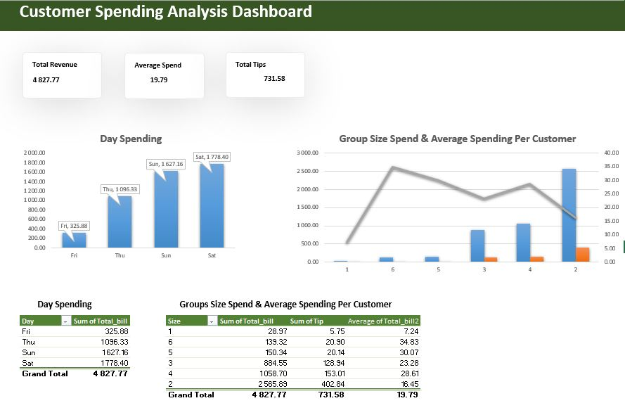

# Customer Spending Analysis

### Objective
This project analyzes customer transaction data to identify spending patterns, customer behavior and key revenue drivers. The goal is to demonstrate data analysis and visualization skills using Microsoft Excel.

### Tools Used
- Microsoft Excel (Pivot Tables, Data Cleaning, Visualization)
  
### Key Insights
1. Saturday has the highest total spending, idicating peak customer activity occurs on weekends.
2. The average transaction value is approximately 19.79, suggesting moderate spending per visit across customers.
3. Although larger groups (size >=5) have higher spending per transaction, smaller groups (size 2-4) contribute more to total revenue due to higher frequency.
4. Customer activity is higher on weekends with groups size 2 and 4 being the most frequent. This suggests that moderate sized groups drive majority of transactions.
5. Weekend periods show increased customer volume, suggesting opportunities for targeted promotions or resource allocation during peak times.

### Dashboard

### Project Structure
- data/: raw dataset  
- dashboard/: Excel dashboard  
- screenshots/: visual outputs  
